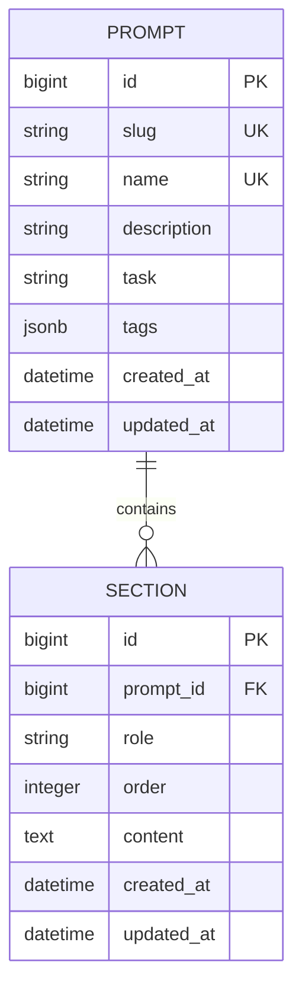

# Data Model: Prompt & Section CRUD 및 다차원 검색

## Entities & Schemas

### 1. Prompt Entity

프롬프트 레지스트리의 최상위 자산 엔티티.

- **Fields**:
  - `id` (BigInt / UUID, Primary Key): 고유 식별자
  - `slug` (CharField, max_length=100, unique=True, db_index=True): 식별용 캐노니컬 문자열
  - `name` (CharField, max_length=255, unique=True, db_index=True): 인간이 읽을 수 있는 프롬프트 이름 (고유값)
  - `description` (TextField, blank=True): 프롬프트 용도 및 설명
  - `task` (CharField, max_length=100, db_index=True, blank=True): 업무/도메인 구분 (예: `customer-support`, `code-generation`)
  - `tags` (JSONField, default=list): 태그 키워드 배열 (예: `["summary", "v1"]`)
  - `created_at` (DateTimeField, auto_now_add=True): 생성일시
  - `updated_at` (DateTimeField, auto_now=True): 수정일시

- **Validation Rules**:
  - `name`은 시스템 전체에서 중복될 수 없음 (`unique=True`).
  - `tags`는 문자열 리스트 형식이어야 함.

- **Indexes & Constraints**:
  - `unique_prompt_name`: `name` 필드 Unique 제약 조건.
  - `idx_prompt_task`: `task` 필드 인덱싱으로 고속 필터링 지원.

---

### 2. Section Entity

프롬프트를 구성하는 개별 지침/메시지 조각 엔티티.

- **Fields**:
  - `id` (BigInt / UUID, Primary Key): 고유 식별자
  - `prompt` (ForeignKey -> Prompt, on_delete=CASCADE, related_name="sections"): 소속 프롬프트
  - `role` (CharField, max_length=20, choices=[system, user, assistant, tool], default=user): 섹션 역할
  - `order` (PositiveIntegerField, default=0): 프롬프트 내 순서
  - `content` (TextField): 섹션 본문 텍스트
  - `created_at` (DateTimeField, auto_now_add=True): 생성일시
  - `updated_at` (DateTimeField, auto_now=True): 수정일시

- **Validation Rules**:
  - 동일 프롬프트 내에서 `order` 값은 고유해야 함.
  - `role`은 정의된 4가지 옵션(`system`, `user`, `assistant`, `tool`) 중 하나여야 함.

- **Indexes & Constraints**:
  - `unique_section_order_per_prompt`: `(prompt, order)` 복합 Unique 제약 조건.

---

## Entity Relationship Diagram (ERD)

