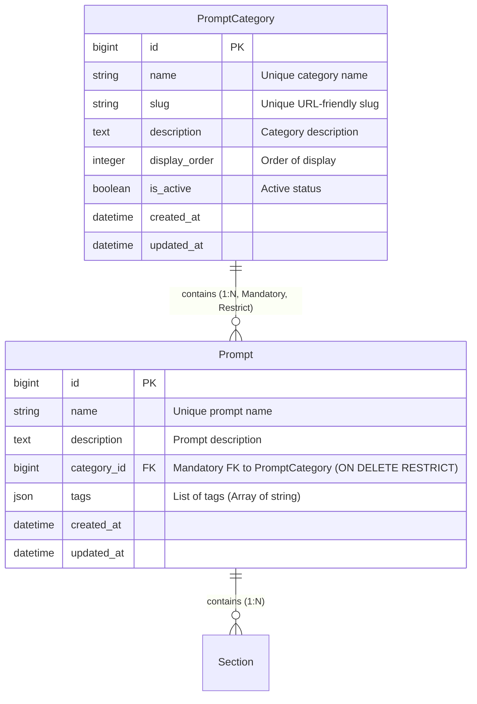

# Phase 1 Data Model: PromptCategory 독립 모델링 및 관리 API 개발

**Feature**: [`spec.md`](./spec.md) | **Branch**: `005-prompt-category-api` | **Date**: 2026-07-30

## Entity Relationship Diagram (ERD)

---

## Model Specifications

### 1. `PromptCategory` Model (`apps/server/prompts/models.py`)

프롬프트를 업무/도메인별로 분류하기 위한 정규화된 독립 카테고리 엔티티입니다.

| Attribute | Type | Constraints | Description |
|-----------|------|-------------|-------------|
| `id` | `BigAutoField` | Primary Key, Auto Increment | 고유 식별자 |
| `name` | `CharField(max_length=100)` | Unique, Non-null | 카테고리 이름 (예: "고객지원", "코드생성") |
| `slug` | `SlugField(max_length=100)` | Unique, Non-null, db_index | API 및 URL용 영문 고유 슬러그 (예: "customer-support") |
| `description` | `TextField` | Blank=True, Default="" | 카테고리에 대한 상세 설명 |
| `display_order` | `IntegerField` | Default=0, db_index | 목록 조회 시 정렬 우선순위 |
| `is_active` | `BooleanField` | Default=True, db_index | 카테고리 활성화/사용 가능 여부 |
| `created_at` | `DateTimeField` | auto_now_add=True | 카테고리 생성 일시 |
| `updated_at` | `DateTimeField` | auto_now=True | 카테고리 최종 수정 일시 |

- **Validation Rules**:
  - `name` 및 `slug`는 시스템 전체에서 고유(Unique)해야 합니다.
  - 삭제 시 연결된 `Prompt` 객체가 1개 이상 존재하면 `models.RESTRICT`에 의해 삭제가 거부되고 `409 Conflict` (DRF `ProtectedError` 예외 처리)가 발생합니다.

---

### 2. `Prompt` Model 개정 (`apps/server/prompts/models.py`)

기존 단순 문자열 `task` 필드가 정규화된 `PromptCategory` 외래키(`category`)로 교체 개정됩니다.

| Attribute | Type | Constraints | Description |
|-----------|------|-------------|-------------|
| `id` | `BigAutoField` | Primary Key, Auto Increment | 고유 식별자 |
| `name` | `CharField(max_length=255)` | Unique, Non-null | 프롬프트 이름 |
| `description` | `TextField` | Blank=True, Default="" | 프롬프트 설명 |
| `category` | `ForeignKey(PromptCategory)` | Non-null (Mandatory), `on_delete=models.RESTRICT`, `related_name='prompts'` | 도메인 카테고리 참조 외래키 |
| `tags` | `JSONField` | Default=list | 프롬프트 태그 목록 (예: `["v1", "summary"]`) |
| `created_at` | `DateTimeField` | auto_now_add=True | 생성 일시 |
| `updated_at` | `DateTimeField` | auto_now=True | 최종 수정 일시 |

- **Validation Rules**:
  - `category` 지정을 생략하거나 유효하지 않은 `category_id`를 전달하는 경우 `400 Bad Request` 유효성 오류를 반환합니다.

---

## State & Data Lifecycle

1. **Category Lifecycle**:
   - `Create`: 관리자 API를 통해 `name`, `slug`, `description` 등을 지정하여 카테고리 생성.
   - `Read/List`: 카테고리 전체 목록 조회 시 `prompt_count` (연결된 프롬프트 수) 필드가 자동으로 계산되어 응답.
   - `Update`: 카테고리 이름, 슬러그, 설명 수정 시 고유성 검증 수행.
   - `Delete`: `prompts.count() == 0`인 경우에만 삭제 성공. 연결된 프롬프트가 존재할 경우 `409 Conflict` 반환.

2. **Prompt-Category Link Lifecycle**:
   - `Prompt Create`: `category_id`를 필수 인자로 전달받아 유효한 `PromptCategory` 존재 여부 확인 후 매핑.
   - `Prompt Filter`: `category` ID, `category_slug` 영문 슬러그, 또는 레거시 `task` 파라미터로 해당 카테고리에 속한 프롬프트만 정밀 필터링.
