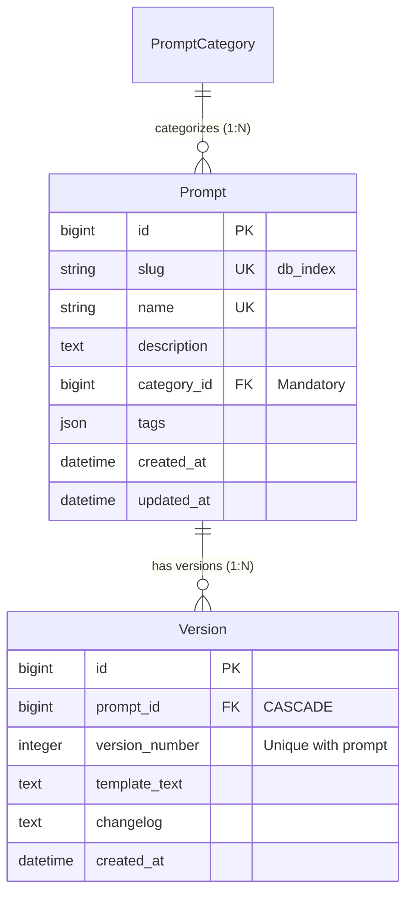

# Phase 1 Data Model: Prompt Version(이력 관리 및 롤백) API 개발

**Feature**: [`spec.md`](./spec.md) | **Branch**: `006-prompt-version-api` | **Date**: 2026-07-30

## Entity Relationship Diagram (ERD)



## Entity Specifications

### 1. Version (프롬프트 버전 스냅샷)

프롬프트의 특정 시점 템플릿 텍스트와 변경 내역을 담고 있는 불변(Immutable) 스냅샷 엔티티입니다.

| Attribute Name | Data Type | Constraints | Description |
|----------------|-----------|-------------|-------------|
| `id` | BigAutoField | PK | 고유 식별자 |
| `prompt` | ForeignKey(Prompt) | FK, CASCADE, related_name='versions' | 연관된 대상 프롬프트 참조 |
| `version_number` | PositiveIntegerField | Mandatory | 프롬프트 내 순차 버전 번호 (1, 2, 3...) |
| `template_text` | TextField | Blank allowed | 버전 시점의 프롬프트 템플릿 텍스트 |
| `changelog` | TextField | Blank allowed | 버전 생성/롤백 사유 및 변경 설명 |
| `created_at` | DateTimeField | auto_now_add | 스냅샷 생성일시 |

#### Constraints & Rules
- **Unique Constraint**: `UniqueConstraint(fields=["prompt", "version_number"], name="unique_prompt_version_number")`
- **Default Ordering**: `["prompt", "-version_number"]` (최신 버전 우선 정렬)
- **Immutability**: 생성 후 `template_text` 및 `version_number` 수정 불가능 (조회만 허용)

---

## API Data Transfer Objects (DTOs / Serializers)

### 1. VersionSerializer (Detail & List)
```json
{
  "id": 1,
  "prompt": 10,
  "version_number": 2,
  "template_text": "Hello {user}, how can I help you today?",
  "changelog": "Updated greeting message",
  "created_at": "2026-07-30T11:46:00Z"
}
```

### 2. RollbackRequestDTO
```json
{
  "target_version": 1,
  "changelog": "Rolled back to v1 due to template bug"
}
```

### 3. VersionDiffResponseDTO
```json
{
  "prompt_id": 10,
  "from_version": 1,
  "to_version": 2,
  "diff": [
    {
      "line": 1,
      "op": "equal",
      "text": "Hello user"
    },
    {
      "line": 2,
      "op": "deleted",
      "text": "Old instruction text"
    },
    {
      "line": 2,
      "op": "added",
      "text": "New instruction text"
    }
  ]
}
```
