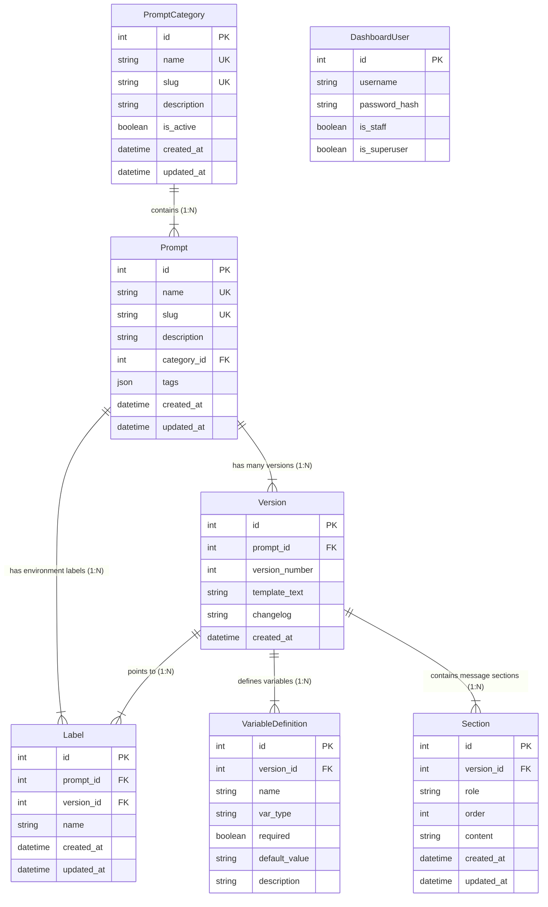

# Data Model: promptkit 프로젝트 컨셉 재정의 및 문서화

## Entity Relationships

---

## Entity Details

### 1. DashboardUser (대시보드 관리자 계정)
- **Role**: Django 내장 `User` 모델을 활용하여 대시보드 웹 화면 로그인 및 접근 권한 통제.
- **Attributes**:
  - `username`: 관리자 계정 아이디
  - `is_staff`: 대시보드 관리자 권한 여부
- **Access Rule**: 대시보드 웹 화면 로그인 전용 (Django Session Auth). DB 테이블 차원에서 `Prompt`와의 직접적인 외래키 연관 관계는 맺지 않으며, 모든 인증된 관리자는 대시보드를 통해 레지스트리 전체 프롬프트를 CUD 할 수 있음.

### 2. Prompt & PromptCategory (프롬프트 레지스트리 코어)
- **Role**: 대시보드를 통해서만 CUD(생성/수정/삭제)되며, SDK에는 Read-only API를 통해 반환되는 주 데이터 구조.
- **Attributes**:
  - `category`: 필수 외래키 (`PromptCategory`). 프롬프트의 도메인/태스크 분류.
  - `slug`: 프롬프트 식별 키 (예: `customer-support`)
  - `name`: 인간이 읽을 수 있는 명칭
- **Access Policy**:
  - **대시보드**: CUD 및 카테고리별 프롬프트 관리 화면 제공
  - **SDK**: Read-only API를 통한 조회 전용

### 3. Version, Label, VariableDefinition, Section (프롬프트 상세 버전 및 구성)
- **Version**: 불변(Immutable) 프롬프트 템플릿 스냅샷.
- **Label**: `production`(기본값), `dev`, `draft` 등의 라벨 포인트.
- **VariableDefinition**: 동적 변수 스키마 및 타임 검증 규칙.
- **Section**: System, User, Assistant 등 메시지 역할별 섹션 분할 데이터.

---

## Authentication Security Model (Non-DB Configuration)

### SDK Authentication (`PROMPTKIT_API_KEY`)
- **Mechanism**: 별도의 DB 테이블(`ApiKey`)을 생성하지 않으며, 서버의 `.env` 환경 변수(또나 Django Settings)에 정의된 `PROMPTKIT_API_KEY` 값을 통해 검증.
- **Header**: SDK 요청 시 `X-PromptKit-Api-Key` HTTP 헤더로 전달된 키 값을 서버가 정적으로 검증.
- **Isolation**: 대시보드 관리자 세션과 완벽히 격리되어 있으며, 오직 Read-only 프롬프트 조회 API 엔드포인트에서만 검증에 사용됨.
